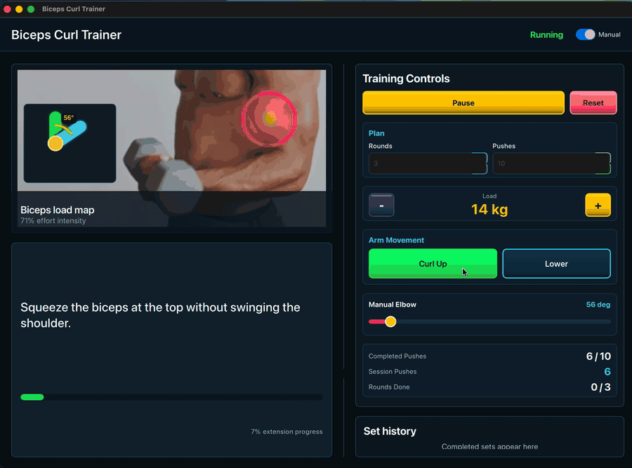
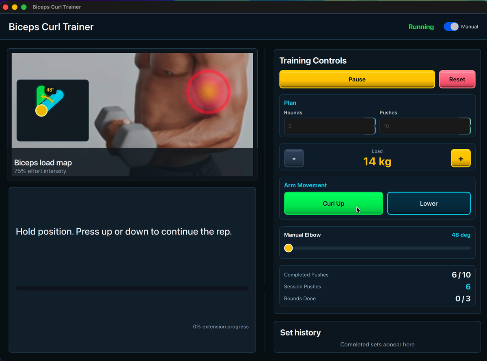
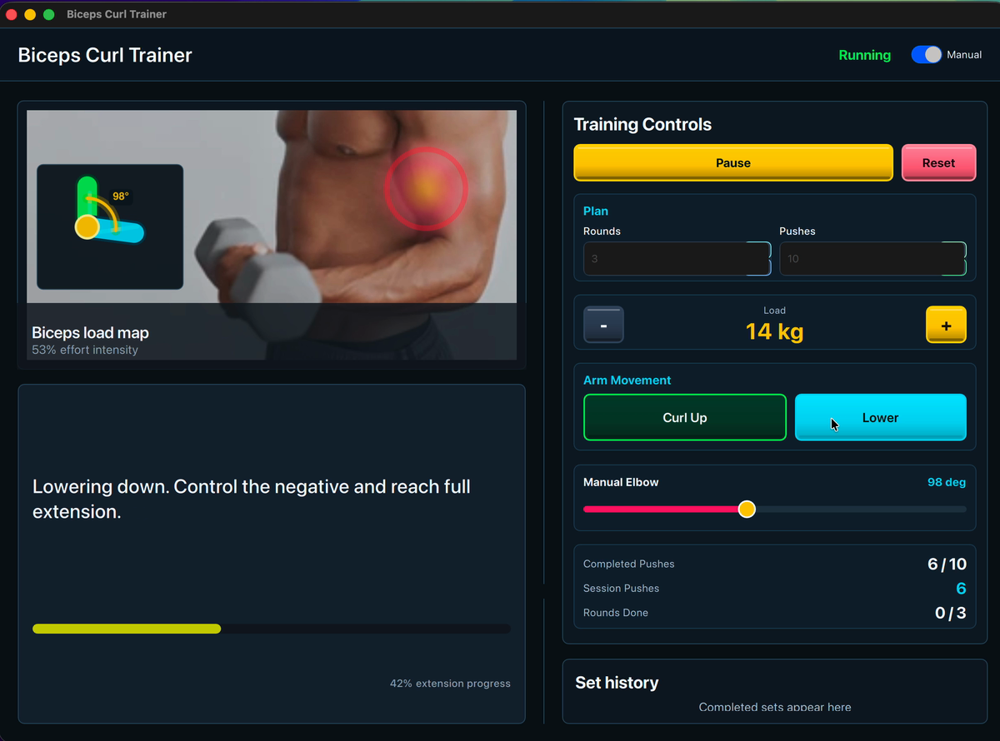

# Biceps Curl Trainer Qt/QML

A professional one-muscle training app built with Qt 6, QML, and modern C++. The app focuses on biceps curl training with animated interactive visuals, guided/manual modes, form scoring, rep/set tracking, load control, and coaching cues.

## Demo Output



The demo shows the real application output: biceps heat-map feedback, manual elbow movement, load controls, completed-push counters, and the training control panel.

| Ready State | Active Training |
| :---: | :---: |
|  |  |

## Features

- Animated biceps curl motion view drawn with QML Canvas.
- Photo-based biceps panel with a dynamic gradient heat overlay.
- Gradient muscle intensity changes with activation and selected load.
- Guided curl tempo: curl up, squeeze, lower slow.
- Manual mode with press-and-hold Curl Up / Lower Down controls.
- Keyboard Up/Down arrows control the arm in manual mode.
- Elbow-angle slider for precise direct arm control.
- Selectable workout plan: rounds and pushes per round.
- Paused workout edits preserve progress and apply when Continue is pressed.
- Completed-push counter that increments after each full curl motion.
- Session push total for all completed curl motions.
- Glowing round-complete encouragement when the selected push target is met.
- Left coaching progress bar maps elbow angle exactly from 48 degrees to 165 degrees.
- C++ workout engine for reps, sets, load, form score, calories, and coaching.
- Set history list with completed rounds, load, reps, and average form score.
- Standalone Qt Creator project using CMake.

## Requirements

- Qt 6.5 or newer. Qt 6.10.2 is supported.
- Qt Creator.
- CMake 3.24 or newer.
- C++20-capable compiler.

## Run In Qt Creator

1. Open Qt Creator.
2. Choose **File > Open File or Project**.
3. Select:

   ```text
   BicepsCurlTrainer_QtQml/CMakeLists.txt
   ```

4. Select your Desktop Qt kit, for example:

   ```text
   Qt 6.10.2 (macos)
   ```

5. Click **Configure Project**.
6. Build and run.

## Run From Terminal

If your Qt environment is available to CMake:

```sh
cmake -S . -B build
cmake --build build
./build/biceps_curl_trainer
```

If you use a custom Qt install path:

```sh
cmake -S . -B build -DCMAKE_PREFIX_PATH="/path/to/Qt/6.10.2/macos"
cmake --build build
./build/biceps_curl_trainer
```

On this machine the working Qt path is:

```sh
cmake -S . -B build -DCMAKE_PREFIX_PATH="/Users/ahmedabdelaziz/MyBrain/Qt/6.10.2/macos"
cmake --build build
./build/biceps_curl_trainer.app/Contents/MacOS/biceps_curl_trainer
```

## Project Structure

```text
BicepsCurlTrainer_QtQml/
├── CMakeLists.txt
├── Main.qml
├── main.cpp
├── biceps_workout_controller.h
├── biceps_workout_controller.cpp
├── qml/
│   ├── AnatomyFocusView.qml
│   ├── CoachPanel.qml
│   ├── CurlMotionView.qml
│   ├── MetricCard.qml
│   ├── MovementButton.qml
│   ├── PhotoMuscleOverlay.qml
│   ├── SetHistoryList.qml
│   └── TempoTimeline.qml
├── assets/
│   ├── biceps_curl_reference.png
│   └── screenshots/
│       ├── biceps_trainer_demo.gif
│       ├── biceps_trainer_ready.png
│       └── biceps_trainer_overview.png
└── docs/
    ├── ARCHITECTURE.md
    ├── LEARNING_GUIDE.md
    └── PROJECT_OVERVIEW.md
```

## Learning Path

Read these files in order:

1. [docs/LEARNING_GUIDE.md](docs/LEARNING_GUIDE.md)
2. [docs/ARCHITECTURE.md](docs/ARCHITECTURE.md)
3. [docs/PROJECT_OVERVIEW.md](docs/PROJECT_OVERVIEW.md)
4. [biceps_workout_controller.h](biceps_workout_controller.h)
5. [biceps_workout_controller.cpp](biceps_workout_controller.cpp)
6. [Main.qml](Main.qml)
7. [qml/PhotoMuscleOverlay.qml](qml/PhotoMuscleOverlay.qml)
8. [qml/CurlMotionView.qml](qml/CurlMotionView.qml)

## Main Engineering Idea

C++ owns the workout domain: state, reps, sets, form score, tempo, and coaching. QML owns the interactive visual training experience. This is the same separation you want in a serious Qt/QML product: a stable backend API and a reactive presentation layer.

## Rep Counting Rule

In manual mode, one completed push is counted when the arm reaches the contracted position and then returns to the extended position. With the slider, that means moving from the left side toward the right side after the curl peak. When the completed-push counter reaches the selected pushes per round, the app records the round in history and shows a glowing encouragement message.

The left coaching progress bar uses this direct mapping:

```text
progress = (elbowAngle - 48) / (165 - 48)
```

So `48 deg` is empty and `165 deg` is full.

If the workout is paused, changing rounds or pushes does not reset the workout. The new target is applied when the user presses Continue, while completed pushes and completed rounds remain accumulated.
