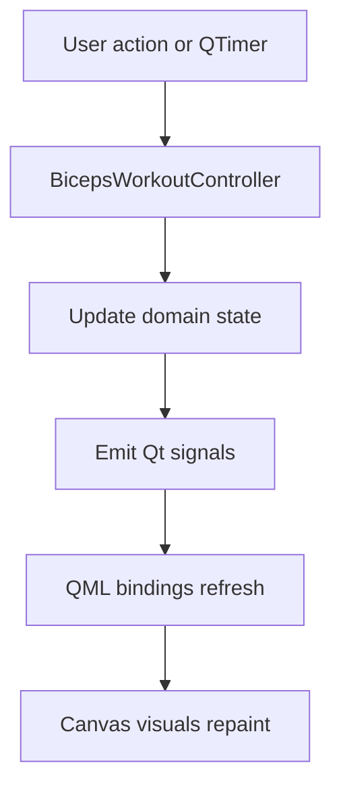

# Architecture

## Overview

The project is split into two layers:

- **C++ backend:** `BicepsWorkoutController`
- **QML frontend:** dashboard layout and visual components

QML never calculates workout state. It reads properties from C++ and calls invokable C++ methods when the user presses controls.

## C++ Backend

`BicepsWorkoutController` owns:

- Session state: ready, running, paused, complete.
- Guided/manual mode.
- Selected training plan: rounds and pushes per round.
- Elbow angle.
- Biceps activation.
- Form score.
- Rep and set counting.
- Load selection.
- Tempo phase.
- Coaching cue.
- Set history.

The simulation runs from a `QTimer` every 50 ms.

## QML Frontend

`Main.qml` composes the screen:

- Anatomy focus panel.
- Photo muscle heat map.
- Animated curl motion.
- Tempo timeline.
- Metric cards.
- Training controls.
- Keyboard Up/Down manual arm control.
- Set history.

Reusable components live in `qml/`.

`PhotoMuscleOverlay.qml` uses a real reference image plus a Canvas heat map. The C++ activation and load values control the overlay intensity, so the visual feedback becomes stronger when the athlete curls harder or selects more weight.

## Data Flow



## Qt Concepts

### `Q_PROPERTY`

Properties expose backend state to QML:

```cpp
Q_PROPERTY(double elbowAngle READ elbowAngle NOTIFY metricsChanged)
Q_PROPERTY(QString coachCue READ coachCue NOTIFY coachCueChanged)
```

### `Q_INVOKABLE`

QML calls backend commands:

```cpp
Q_INVOKABLE void start();
Q_INVOKABLE void setManualAngle(double angle_degrees);
```

### Canvas Visuals

The body and arm visuals are drawn in QML Canvas. This keeps the project dependency-light while still giving professional, dynamic training illustrations.

## Why This Is A Good Qt/QML Portfolio Project

It shows the important senior UI software skills:

- Clear C++/QML boundary.
- Reactive properties and signals.
- Custom QML drawing.
- Interactive stateful UI.
- Domain-specific product thinking.
