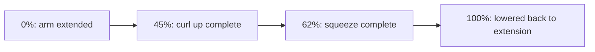

# Learning Guide

## 1. Run The App

Open this file in Qt Creator:

```text
BicepsCurlTrainer_QtQml/CMakeLists.txt
```

Select your Desktop Qt 6 kit and run the app.

If Qt Creator asks for CMake variables, use:

```text
CMAKE_PREFIX_PATH=/Users/ahmedabdelaziz/MyBrain/Qt/6.10.2/macos
```

## 2. Use The App

1. Press **Start**.
2. Watch the curl animation move through curl up, squeeze, and lower slow phases.
3. Set **Rounds** and **Pushes** before training.
4. Change the load with **+** and **-**.
5. Switch on **Manual** mode.
6. Hold **Curl Up** or press the **Up Arrow** to raise the arm.
7. Hold **Lower Down** or press the **Down Arrow** to lower the arm.
8. Watch the biceps photo overlay change from cool blue/green to hot orange/red as effort increases.
9. Drag the elbow-angle slider for direct angle control.
10. Move from the contracted side back to the extended side to count one completed push.
11. Complete the selected number of pushes in every round and watch the glowing encouragement message plus set history update.

## 3. Understand `main.cpp`

This line exposes the C++ object to QML:

```cpp
engine.rootContext()->setContextProperty("workoutController", &workout_controller);
```

That is why QML can write:

```qml
workoutController.start()
workoutController.elbowAngle
```

## 4. Understand The Header

Open `biceps_workout_controller.h`.

Focus on:

- `Q_PROPERTY`: values QML can read.
- `Q_INVOKABLE`: commands QML can call.
- signals: notifications that trigger QML updates.

## 5. Understand The Simulation

Open `biceps_workout_controller.cpp`.

Read these methods first:

- `tick`
- `updateGuidedMotion`
- `updateButtonDrivenMotion`
- `updateDerivedMetrics`
- `detectRep`
- `completeCurrentSet`

The selected plan is exposed through:

```cpp
Q_PROPERTY(int selectedRounds READ selectedRounds WRITE setSelectedRounds NOTIFY targetChanged)
Q_PROPERTY(int pushesPerRound READ pushesPerRound WRITE setPushesPerRound NOTIFY targetChanged)
```

The keyboard and buttons use the same C++ commands:

```cpp
Q_INVOKABLE void curlUp();
Q_INVOKABLE void lowerDown();
Q_INVOKABLE void stopArm();
```

The guided curl is a periodic movement:



A rep is counted when the arm reaches the top and then returns near full extension.

Every completed push increments `totalPushesCompleted`. Every completed round is appended to `setHistory`, and the `completedRounds` property exposes the history count back to QML:

```cpp
Q_PROPERTY(int completedRounds READ completedRounds NOTIFY setHistoryChanged)
Q_PROPERTY(int totalPushesCompleted READ totalPushesCompleted NOTIFY repChanged)
```

QML listens for the round-complete signal to show the glowing encouragement:

```qml
Connections {
    target: workoutController

    function onRoundCompleted(message) {
        root.roundCelebration = message
    }
}
```

## 6. Understand The Visuals

Open `qml/PhotoMuscleOverlay.qml` first.

The photo is loaded as a Qt resource:

```qml
source: "qrc:/qt/qml/BicepsCurlTrainer/assets/biceps_curl_reference.png"
```

The biceps heat map is drawn on top using QML Canvas. Its intensity is based on activation and load.

Then open `qml/CurlMotionView.qml`.

The arm is drawn with Canvas:

- shoulder point
- elbow point
- wrist point
- upper arm line
- forearm line
- highlighted biceps curve

The elbow angle from C++ changes the wrist position, which animates the arm.

## 7. What To Say About It

Say:

> I built this as a focused biceps training app. C++ owns workout state, rep detection, form scoring, and coaching. QML owns the training visuals and interaction. The important part is the clean boundary between domain logic and presentation.
