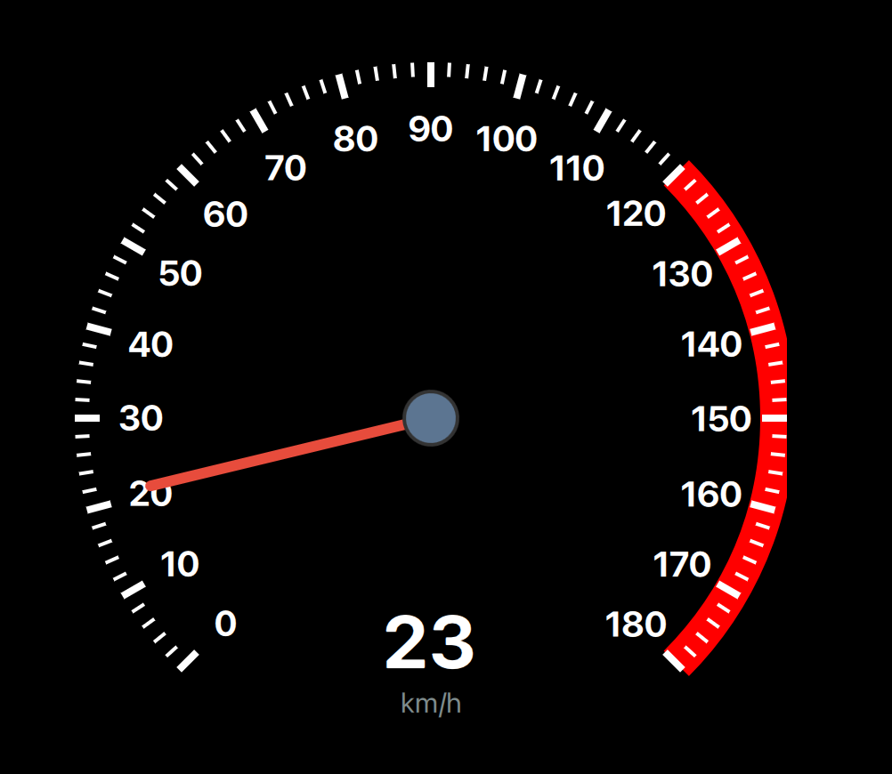
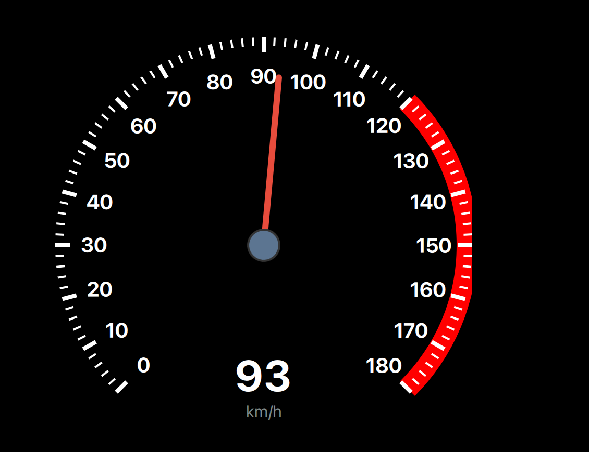
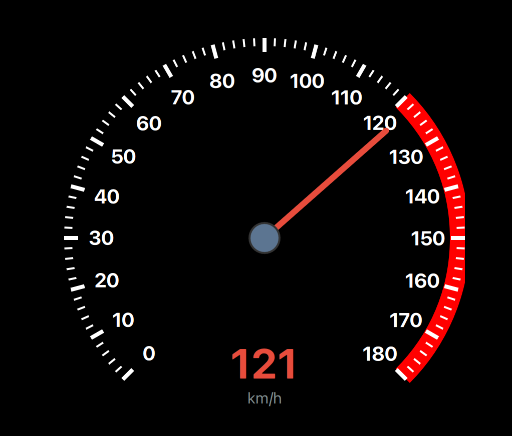
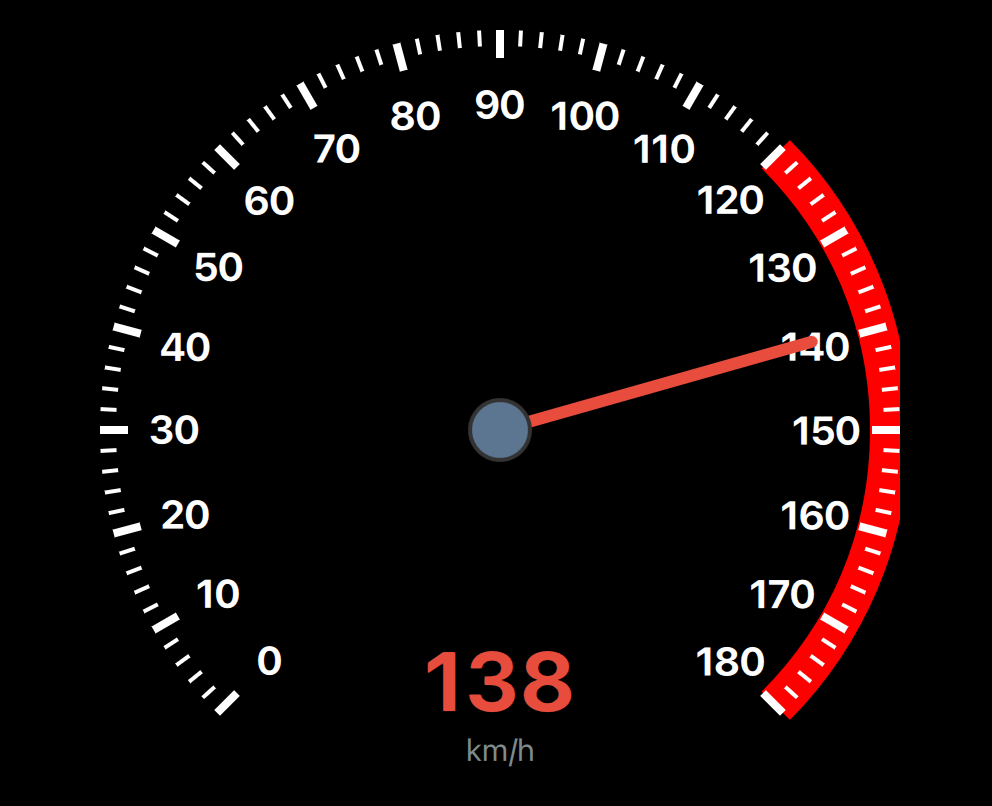

# Car Dashboard Speedometer Qt/QML

A polished automotive speedometer built with Qt 6 and QML. The project demonstrates a custom dashboard gauge, keyboard-driven acceleration and braking, a 60 FPS timer loop, custom tick/label rendering, and a high-speed warning readout.

## Demo Output


The demo shows the real application output across multiple speed levels: the needle rotation, speed arc, digital readout, and the high-speed color change.

## Features

- Custom QML `Dial` styled as an automotive speedometer.
- Speed range from `0` to `180 km/h`.
- Keyboard controls for acceleration and braking.
- Smooth coasting behavior when no key is pressed.
- 60 FPS timer-based simulation loop.
- Custom needle, center pivot, tick marks, and numeric labels.
- Canvas-drawn speed arc.
- Digital speed readout that turns red above `120 km/h`.
- Visual screenshots for multiple speed levels.
- Standalone Qt Creator project using CMake.

## Requirements

- Qt 6.8 or newer, based on the current `CMakeLists.txt`.
- Qt Creator.
- CMake 3.16 or newer.
- C++ compiler supported by your selected Qt kit.

## Run In Qt Creator

1. Open Qt Creator.
2. Choose **File > Open File or Project**.
3. Select:

   ```text
   Car_DashBoard_Speedometer/CMakeLists.txt
   ```

4. Select your Desktop Qt 6 kit.
5. Click **Configure Project**.
6. Build and run.
7. Click the window once if keyboard focus is not active.

## Run From Terminal

If your Qt environment is available to CMake:

```sh
cmake -S . -B build
cmake --build build
./build/appCar_DashBoard_Speedometer
```

If you use a custom Qt install path:

```sh
cmake -S . -B build -DCMAKE_PREFIX_PATH="/path/to/Qt/6.x/macos"
cmake --build build
./build/appCar_DashBoard_Speedometer.app/Contents/MacOS/appCar_DashBoard_Speedometer
```

On this machine, the known Qt path used in related projects is:

```sh
cmake -S . -B build -DCMAKE_PREFIX_PATH="/Users/ahmedabdelaziz/MyBrain/Qt/6.10.2/macos"
cmake --build build
./build/appCar_DashBoard_Speedometer.app/Contents/MacOS/appCar_DashBoard_Speedometer
```

## Controls

| Key | Action | Behavior |
| --- | --- | --- |
| `Up Arrow` | Accelerate | Increases speed until the `180 km/h` limit. |
| `Down Arrow` | Brake | Decreases speed faster than coasting. |
| No key | Coast | Gradually reduces speed toward `0 km/h`. |

## Visual Showcase

| Speed Level 1 | Speed Level 2 | Speed Level 3 | Speed Level 4 |
| :---: | :---: | :---: | :---: |
|  |  |  |  |

## Project Structure

```text
Car_DashBoard_Speedometer/
├── CMakeLists.txt
├── Main.qml
├── main.cpp
├── Qt5_6_NoteDifferences.md
├── Images/
│   ├── car_dashboard_demo.gif
│   ├── meter_1.png
│   ├── meter_2.png
│   ├── meter_3.png
│   └── meter_4.png
└── docs/
    ├── ARCHITECTURE.md
    ├── LEARNING_GUIDE.md
    └── PROJECT_OVERVIEW.md
```

## Learning Path

Read these files in order:

1. [docs/LEARNING_GUIDE.md](docs/LEARNING_GUIDE.md)
2. [docs/ARCHITECTURE.md](docs/ARCHITECTURE.md)
3. [docs/PROJECT_OVERVIEW.md](docs/PROJECT_OVERVIEW.md)
4. [main.cpp](main.cpp)
5. [Main.qml](Main.qml)
6. [CMakeLists.txt](CMakeLists.txt)

## Main Engineering Idea

C++ provides the Qt application bootstrap, while QML owns the dashboard interaction and rendering. The project is a compact example of a custom, animated Qt Quick control: the `Dial` supplies the value/angle model, and QML customizes the gauge visuals, keyboard input, and simulation timing.

## Speed Simulation Rule

The `Timer` runs every `16 ms` and updates `speedometer.value`:

```text
accelerating: +1.2 km/h per tick
braking:      -2.5 km/h per tick
coasting:     -0.3 km/h per tick
```

The value is clamped to the configured speed range:

```text
0 <= speed <= 180
```

## GitHub Link

[Open this project on GitHub](https://github.com/aaabdelaziz/Qt_Projects/blob/main/Car_DashBoard_Speedometer)
