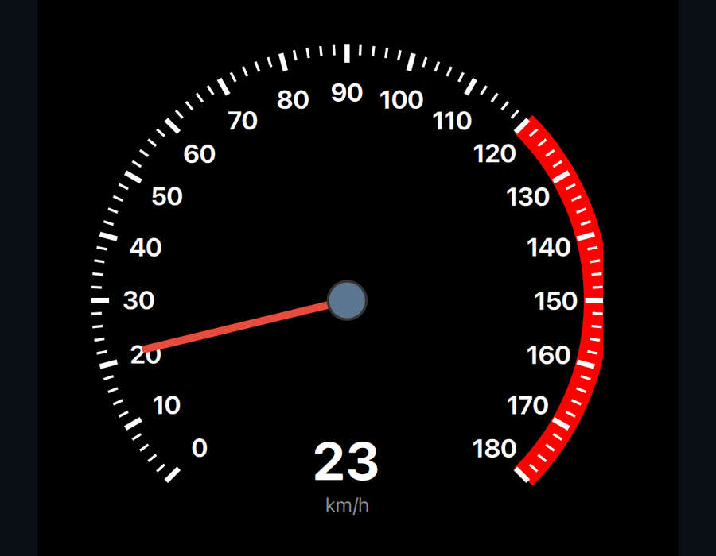
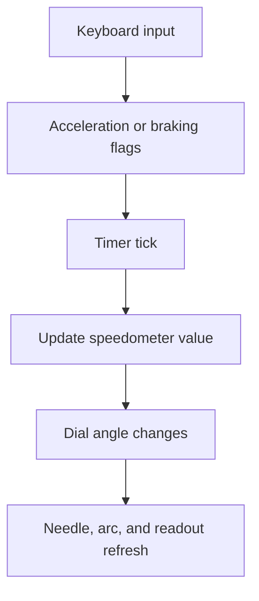

# Architecture

## Overview

The project is intentionally simple and split into two layers:

- **C++ bootstrap:** creates the Qt application and loads the QML module.
- **QML dashboard:** owns the gauge UI, keyboard input, animation, and speed simulation.

There is no separate C++ domain model in this project. That is appropriate for this demo because the state is small: current speed, acceleration flag, and braking flag.

## Application Output



The output is a single focused dashboard component. The QML value state controls the needle angle, speed arc, numeric readout, and high-speed warning color.

## C++ Bootstrap

`main.cpp` owns the standard Qt startup flow:

- Creates `QGuiApplication`.
- Creates `QQmlApplicationEngine`.
- Connects `objectCreationFailed` to application exit.
- Loads the QML module:

```cpp
engine.loadFromModule("Car_DashBoard_Speedometer", "Main");
```

## QML Dashboard

`Main.qml` composes the entire user experience:

- `Window` creates the application surface.
- `Dial` provides the speed value range and angle model.
- `Keys.onPressed` and `Keys.onReleased` capture keyboard input.
- `Timer` updates speed at roughly 60 FPS.
- `Canvas` draws the arc.
- `Repeater` creates tick marks and numeric labels.
- Custom `handle` draws the red needle and center pivot.
- `Text` displays the digital speed readout.
- `MouseArea` restores focus when the user clicks the window.

## Data Flow



## Important State

The main state lives directly on the `Dial`:

- `value`: current speed.
- `from`: minimum speed.
- `to`: maximum speed.
- `acceleration`: true while Up Arrow is held.
- `braking`: true while Down Arrow is held.

The `Timer` is the simulation loop and applies acceleration, braking, or coasting based on those flags.

## Custom Gauge Rendering

The default `Dial` visuals are replaced with custom QML:

- The `background` item draws ticks, labels, and the speed arc.
- The `handle` item draws the needle and pivot.
- The digital readout is placed over the bottom of the dial.

This keeps the project dependency-light while still showing custom product UI work.

## Why This Is A Good Qt/QML Portfolio Project

It shows several practical Qt/QML UI skills:

- Customizing a built-in Qt Quick Control.
- Keyboard event handling and focus management.
- Timer-driven animation.
- Canvas drawing.
- Repeater-based gauge marks.
- Responsive declarative layout.
- Clear visual feedback for speed thresholds.
